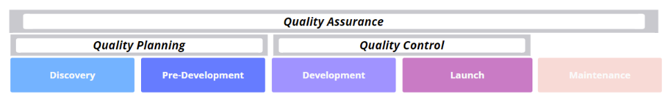

# Quality Control Strategy

## Scope and objectives

The purpose of this document is to give a common understanding of all steps that happen during the Quality Control (QC) phase
in order to make sure we are delivering the highest quality possible for any new Node release/hard-fork.

This document also helps to clarify the QC activities, roles, responsibilities, processes and practices to be used on the Cardano project.

## Key Principles

- **Prevention instead of reaction**; Preventing a problem is always better than fixing it.
- **Work with the team, not against it**: Collaboration is the key to success.
- **Be in users’ shoes**: Always focus on the end-users of our product. We develop software for them, so the user experience is our top priority.
- **Automation first approach**: all tests should be automated.

## Quality Control Approach

Quality Control takes place during the Development and Launch SDLC phases.

It is recommended to create and run automated tests as soon as possible, at the component, integration, and system test levels.
For this reason, it is recommended to use the Shift Left Testing approach that is based on the principle that if the
software development team can test code as it is being developed, they can discover errors earlier than if they wait until
the end of the project.

The Shift Left Testing approach encourages developers to write tests earlier in the development cycle, before code is released for testing.

## Quality Control Methodology

There is a multi-dimensional Quality Control process:

### Active Quality Control

#### During the Pre-Development SDLC phase

- **Acceptance Criteria**, **USer Stories** and **Definition of Done** are created by the Product Owner and signed-off/peer-reviewed by PM, Dev, Test owners
- each user-facing functionality change goes through the Product Owner and is planned accordingly

#### During the Development SDLC phase

- the development work is started based on the Acceptance Criteria
- each new piece of code is covered by tests at dev/unit/component level (for functional and non-functional,
  positive and negative scenarios - based on the acceptance criteria); these tests are part of the PR when merged into master
- the code review of the PRs includes also the review of the test coverage of the new tests for the newly added code
- each PR with user-facing functionalities is passed to the System Test team, together with a clear usage/documentation/example
  to be tested and automated (for functional and non-functional, positive and negative scenarios - based on the acceptance criteria)
- the Test Scenarios proposed by the System Test team are signed off (peer-reviewed) by PO, PM, Dev
- DevOps/DevX support the development process by executing the required updates to the different environments and by monitoring
  the environments for possible errors
- all the configurations on the test environments are similar to the ones from Mainnet (when a parameter value is changed on Mainnet,
  it is updated on all the environments - ex `maxTxExecutionUnits`)
- the System Test team runs frequent Sync tests on all available environments in order to find possible regressions in sync speed,
  sync time, RAM & CPU usage, and disk space usage
- the Benchmark teams run frequent benchmarks in order to find any possible regressions in the core blockchain functionality
- all the integration tests (at Node level) owned by the dev teams are run automatically on a nightly basis
- TBD - all the System Tests (that run on a local cluster) to be run at the PR level on `cardano-node` repository
- all the integration/system/E2E tests owned by the System Test team are run automatically on a nightly basis
- when all the features in the scope of the Release are fully developed, fully tested, and covered by automated tests at
  component/integration/system levels, are fully implemented/tested (as per acceptance criteria & DoD), and have proper documentation,
  a new Node tag is created
- depending on the release scope, there might be some audits (internal or external) required - code, security, legal, etc
- user acceptance testing (UAT) is done by involving different external teams/projects and community members
  (SPOs, dApp developers, other possible users, external contractors, etc)
- DevOps/DevX support the UAT by executing the required updates to the different environments (making sure there are mixed
  node versions used on at least 1 of the internal environments) and by monitoring the environments for possible errors
- the test summary is generated and shared with Delivery/Stakeholders/Community

**TBD**: define what the Test Summary should include

### Passive Quality Control

#### During the Development and Maintenance SDLC phases

- longer-term active monitoring of the different environments through Grafana Dashboards
- longer-term active monitoring of external environment with multiple stake pools with different Node versions
- constant monitoring/grooming/prioritization of the Issues raised by the internal teams using the official channels → GitHub Issues
- constant monitoring/grooming/prioritization of the Issues raised by the community using different mediums (GitHub, Discord, etc)
