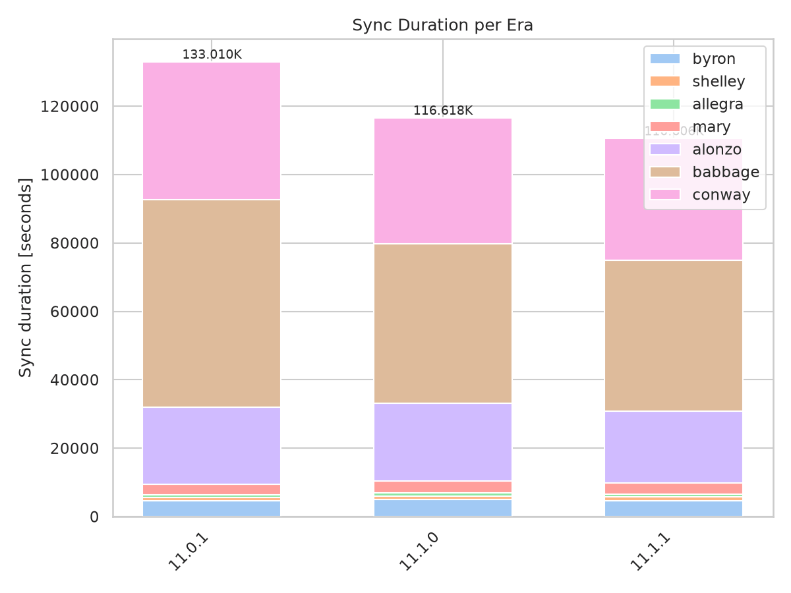
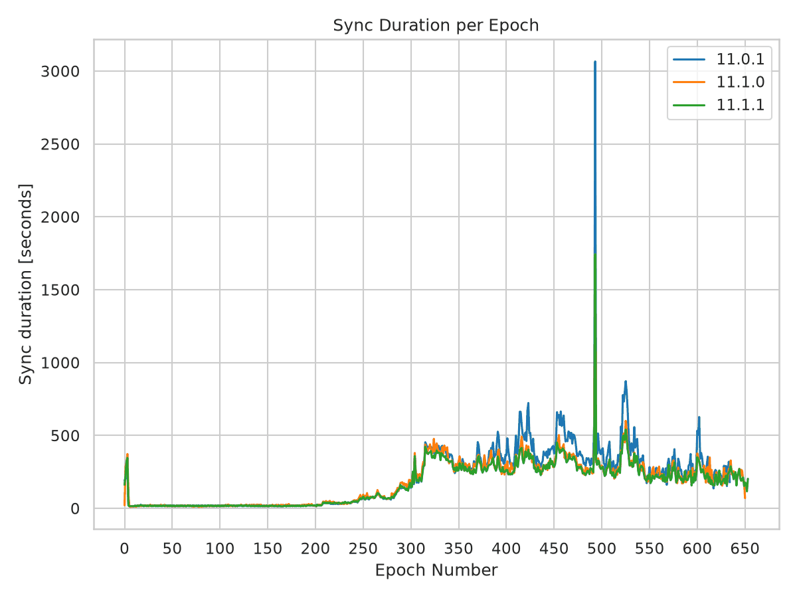
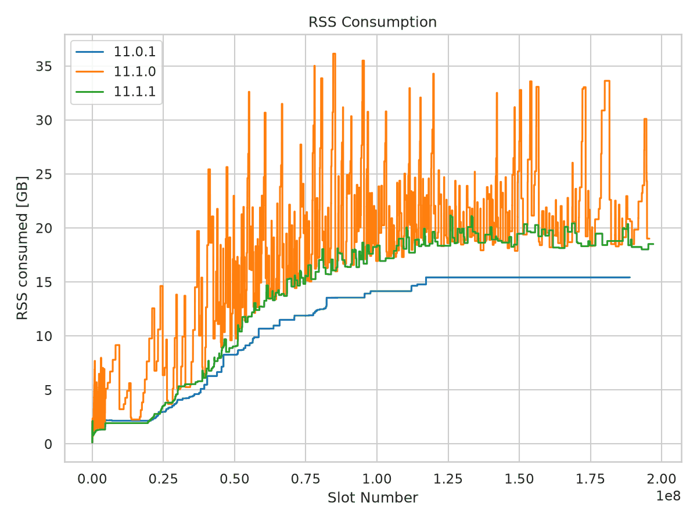
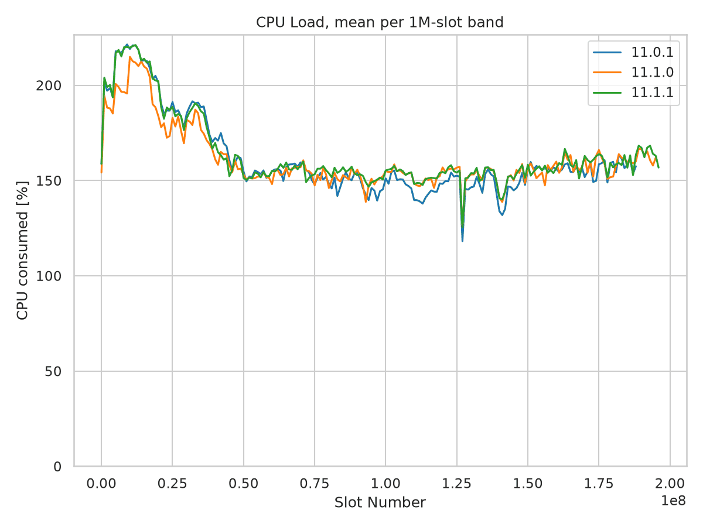

Mainnet Sync Report - 11.1.1
============================

Full mainnet sync from genesis, comparing `cardano-node` 11.1.1 against 11.1.0 and the
11.0.1 baseline. Node 11.1.0 roughly doubled peak memory consumption while getting
faster; this report checks whether 11.1.1 gives that memory back.

**Summary**

* **Regression resolved.** Peak RSS drops from 36.15 GiB to 21.16 GiB against 11.1.0, no
  sample exceeds 25 GiB, and the sawtooth oscillation that characterized 11.1.0 is gone.
* **Residual gap open.** Against 11.0.1, node 11.1.1 still peaks 37% higher on RSS and
  retains 55% more live data. The gap opens early in the chain rather than tracking chain
  growth.
* **Speed improved.** Sync time falls 133,009 -> 116,618 -> 110,606 seconds across the
  three releases. CPU load per wall-second is unchanged.

Key Metrics
-----------

.. list-table::
   :widths: 24 15 15 15 16 16
   :header-rows: 1

   * - Metric
     - 11.0.1
     - 11.1.0
     - 11.1.1
     - 11.1.0 -> 11.1.1
     - 11.0.1 -> 11.1.1
   * - Sync time
     - 133,009 s
     - 116,618 s
     - 110,606 s
     - -5.2%
     - -16.8%
   * - Peak RSS
     - 15.43 GiB
     - 36.15 GiB
     - 21.16 GiB
     - -41.5%
     - **+37.1%**
   * - Mean RSS
     - 12.95 GiB
     - 18.92 GiB
     - 15.67 GiB
     - -17.2%
     - +21.0%
   * - Peak GC live bytes
     - 10.28 GiB
     - 25.65 GiB
     - 15.94 GiB
     - -37.9%
     - **+55.1%**
   * - Mean CPU load
     - 152%
     - 156%
     - 157%
     - +0.6%
     - +3.3%
   * - Total CPU time
     - 201,516 s
     - 181,477 s
     - 173,469 s
     - -4.4%
     - -13.9%
   * - Slots synced
     - 188,825,926
     - 195,705,750
     - 197,064,367
     - +1.4 M
     - +8.2 M

CPU load is reported as percent of a single core, so 152% means roughly one and a half
cores busy on average. Load per wall-second is flat across all three releases; the drop in
total CPU time is the shorter sync, not lower utilization.

Sync Performance
----------------

Node 11.1.1 finished 1 h 40 min ahead of 11.1.0 and 6 h 13 min ahead of 11.0.1, while
covering 8.2 million more slots than 11.0.1. Every era is faster than in 11.1.0. Against
11.0.1 the gains are concentrated in Babbage (-27.1%) and Conway (-11.9%); the small
pre-Alonzo eras are 3-9% slower, which at 750-4,700 s each is worth roughly 400 s in total
and is dwarfed by the Babbage saving of 16,435 s.

.. list-table:: Sync duration per era, seconds
   :widths: 16 14 14 14 21 21
   :header-rows: 1

   * - Era
     - 11.0.1
     - 11.1.0
     - 11.1.1
     - 11.1.0 -> 11.1.1
     - 11.0.1 -> 11.1.1
   * - Byron
     - 4,578
     - 4,948
     - 4,701
     - -5.0%
     - +2.7%
   * - Shelley
     - 970
     - 1,096
     - 1,057
     - -3.6%
     - +9.0%
   * - Allegra
     - 753
     - 895
     - 805
     - -10.1%
     - +6.9%
   * - Mary
     - 3,178
     - 3,517
     - 3,292
     - -6.4%
     - +3.6%
   * - Alonzo
     - 22,439
     - 22,725
     - 20,901
     - -8.0%
     - -6.9%
   * - Babbage
     - 60,659
     - 46,541
     - 44,224
     - -5.0%
     - -27.1%
   * - Conway
     - 40,433
     - 36,896
     - 35,626
     - -3.4%
     - -11.9%
   * - **Total**
     - **133,009**
     - **116,618**
     - **110,606**
     - **-5.2%**
     - **-16.8%**

Conway is not directly comparable across runs: the era was 55.3 M slots when 11.0.1 was
tested and 63.5 M slots by the 11.1.1 run, so 11.1.1 syncs 15% more Conway in 12% less
time.

   Sync duration per era. The Babbage band accounts for nearly all of the improvement over
   11.0.1.

   Sync duration per epoch.

Memory Consumption
------------------

The three releases produce three distinct heap shapes.

**11.0.1 - monotone staircase.** RTS heap climbs in steps to a 15.34 GiB plateau reached at
slot 134 M and never gives memory back: only 21 decreases across 130,674 samples. No
sample exceeds 20 GiB.

**11.1.0 - volatile sawtooth.** Heap oscillates between roughly 19 and 36 GiB with 204
decreases. 34.7% of samples sit above 20 GiB and 6.0% above 30 GiB. The excursion pattern
begins in Byron - 11.1.0 is already at 9.16 GiB RSS before slot 20 M, where the other two
runs sit near 2.1 GiB.

**11.1.1 - staircase restored.** Heap returns to a staircase, plateauing near 19-20 GiB
with 90 decreases. Only 3.5% of samples exceed 20 GiB and none exceeds 25 GiB. Early-sync
behavior matches 11.0.1: 2.13 GiB peak RSS before slot 10 M against 11.0.1's 2.24 GiB.

.. list-table:: Heap shape and retained data
   :widths: 34 22 22 22
   :header-rows: 1

   * - Measure
     - 11.0.1
     - 11.1.0
     - 11.1.1
   * - Resource samples
     - 130,674
     - 113,097
     - 108,438
   * - Peak RTS heap
     - 15.34 GiB
     - 36.03 GiB
     - 21.07 GiB
   * - Mean RTS heap
     - 12.86 GiB
     - 18.80 GiB
     - 15.59 GiB
   * - p99 RTS heap
     - 15.34 GiB
     - 34.17 GiB
     - 20.34 GiB
   * - Heap decreases
     - 21
     - 204
     - 90
   * - Samples > 20 GiB
     - 0.0%
     - 34.7%
     - 3.5%
   * - Samples > 25 GiB
     - 0.0%
     - 12.8%
     - 0.0%
   * - Samples > 30 GiB
     - 0.0%
     - 6.0%
     - 0.0%
   * - Peak GC live bytes
     - 10.28 GiB
     - 25.65 GiB
     - 15.94 GiB
   * - Mean GC live bytes
     - 6.03 GiB
     - 9.06 GiB
     - 6.86 GiB
   * - Major GCs
     - 1,896
     - 1,331
     - 1,940
   * - Total allocation
     - 336 TB
     - 285 TB
     - 286 TB

GC live bytes is the load-bearing number here, because it measures data the collector could
not reclaim rather than heap the RTS happens to be holding. 11.1.0 retained 2.5x the live
data of 11.0.1 at peak; 11.1.1 retains 1.55x. Both the regression and its fix are therefore
in retained live data, not GC headroom.

Major GC count corroborates this. 11.1.0 ran 1,331 major collections against 1,896 for
11.0.1 - the heap was ballooning between majors. 11.1.1 restores the count to 1,940,
slightly above the 11.0.1 baseline. Total allocation is unchanged between 11.1.0 and 11.1.1
(285 vs 286 TB), so the fix changed what is retained, not what is allocated.

   RSS against slot number. The 11.1.0 sawtooth is absent from 11.1.1, which tracks the
   11.0.1 curve shape at a higher level. RTS heap is not plotted separately: it runs
   parallel to RSS about 90 MB below it in every release.

Where the Residual Gap Opens
----------------------------

The remaining 11.0.1 -> 11.1.1 gap is not chain growth. Node 11.1.1 covered only 8.2 M more
slots and 2.8 GB more chain than 11.0.1, but the divergence starts around slot 40 M and
widens monotonically from there. Truncating all three runs to a common window of slots
<= 188 M leaves the picture unchanged: peak RSS 15.43 / 36.15 / 21.16 GiB.

.. list-table:: Peak RSS by 10 M-slot band, GiB
   :widths: 25 25 25 25
   :header-rows: 1

   * - Slot band
     - 11.0.1
     - 11.1.0
     - 11.1.1
   * - 0-10 M
     - 2.24
     - 9.16
     - 2.13
   * - 20-30 M
     - 4.09
     - 14.63
     - 4.84
   * - 40-50 M
     - 8.26
     - 25.64
     - 9.69
   * - 60-70 M
     - 11.49
     - 31.50
     - 15.33
   * - 80-90 M
     - 13.55
     - 36.15
     - 18.12
   * - 100-110 M
     - 14.15
     - 30.80
     - 19.01
   * - 120-130 M
     - 15.43
     - 25.35
     - 21.16
   * - 150-160 M
     - 15.43
     - 33.58
     - 20.36
   * - 180-190 M
     - 15.43
     - 33.63
     - 20.36
   * - 190-200 M
     - n/a
     - 30.10
     - 18.51

Node 11.1.1 crosses the 15.34 GiB level that 11.0.1 uses as its ceiling at slot 71 M,
roughly halfway through Alonzo. Node 11.1.0 crossed it at slot 37 M.

CPU Load
--------

CPU is the one dimension where nothing moved. All three releases average 152-157% of a
single core over the whole sync, and the slot-binned curves are close to
indistinguishable - they overlap for most of the chain and never separate by more than a
few percent.

The shape is the same in every run: a Byron-era plateau near 220% falling away through
Shelley and Mary, then a flat 150% band from slot 50 M onward once block validation
dominates. The two 11.1.x runs sit 2-7 points above 11.0.1 across the middle of the chain,
which is consistent with them doing the same work in less wall-clock time rather than with
any change in utilization. All three show the same dip near slot 126 M, so it is a property
of the chain at that point, not of a release.

.. list-table:: Mean CPU load by phase, percent of one core
   :widths: 40 20 20 20
   :header-rows: 1

   * - Phase
     - 11.0.1
     - 11.1.0
     - 11.1.1
   * - Slots 0-50 M (Byron to Alonzo)
     - 181
     - 173
     - 180
   * - Slots 50 M+ (Alonzo to Conway)
     - 149
     - 153
     - 154
   * - Slots 90-140 M (Babbage)
     - 144
     - 150
     - 151
   * - Whole sync
     - 152
     - 156
     - 157
   * - Peak sample
     - 355
     - 363
     - 436

With 32 cores available and load never averaging above 1.6 cores, the sync remains I/O- and
single-thread-bound in all three releases. The extra heap 11.1.0 held did not cost
measurable CPU, and the 11.1.1 fix did not buy any back.

   CPU load, averaged per 1 M-slot band. The three releases overlap; the 11.1.x pair runs a
   few points above 11.0.1 through Babbage. Binning is needed to read the curves at all:
   per-sample load swings between roughly 70% and 350% in every release, so the unsmoothed
   series are indistinguishable from one another.

System Configuration
--------------------

.. list-table::
   :widths: 22 78
   :header-rows: 0

   * - Environment
     - mainnet, full sync from genesis
   * - CPU / RAM
     - 32 cores / 134 GB
   * - LedgerDB backend
     - V2InMemory (all runs)
   * - Compiler
     - ghc-9.6 (all runs)
   * - 11.0.1
     - kernel 6.12.37, cli 11.0.0.0, rev ``97036a66bcf8``, 2026-05-31 to 06-02
   * - 11.1.0
     - kernel 6.18.34, cli 11.2.1.0, rev ``94ec4195f15f``, 2026-08-19 to 08-21
   * - 11.1.1
     - kernel 6.18.34, cli 11.2.3.0, rev ``c2ebdc87dfe0``, 2026-09-04 to 09-05

The 11.0.1 run used an older kernel than the two 11.1.x runs. Nothing in the data suggests
the kernel accounts for the memory gap - the difference is visible in GC live bytes, which
is reported by the RTS and not by the OS - but it is the one uncontrolled variable between
the baseline and the 11.1.x runs.

No OOM events were recorded in any of the three runs.

Methodology
-----------

**CPU scale in the 11.0.1 result file.** All three runs emit resource stats through the
new tracing system's human-readable ``Resources: Cpu Ticks ..., RTS heap ..., RSS ...``
line; none emits the legacy ``CentiCpu`` form. The result parser applied a x100 multiplier
on that path until commit ``adbe049`` in `cardano-sync-tests
<https://github.com/IntersectMBO/cardano-sync-tests>`__, so the 11.0.1 file as originally
written recorded CPU 100x too high. Its ``log_values`` have since been re-derived from the
node log with the fixed parser, and every figure below is read from the files as they now
stand - no rescaling. The re-derived values match the old ones exactly on tip, heap and
RSS, and by a factor of 100 on CPU, and they reproduce the 11.1.0 report's figures (peak
RSS +134%, sync -12.3%, CPU +2.6%).

RAM is unaffected: ``heap_ram`` and ``rss_ram`` come from the same log fields in raw bytes
in all three runs and are directly comparable without adjustment.

GC live bytes, major GC counts and total allocation are parsed from the full node logs, not
from the result JSON, which does not carry them. Roughly 1% of result-JSON entries carry a
tip update with no matching resource sample and are stored with zero RAM; those are
excluded from all statistics, matching the graph script's own filter. An excursion above a
threshold is one contiguous run of samples above it.

The binned CPU figure averages the same per-sample data into 1 M-slot bands, keeping bands
with at least 20 samples. The band width is the ``--cpu-band-slots`` option.

Source Data
-----------

.. list-table::
   :widths: 22 78
   :header-rows: 0

   * - Result files
     - ``cardano-node-{11.0.1,11.1.0,11.1.1}.json``
   * - Node logs
     - ``debug/{11.0.1,11.1.0,11.1.1}/node_sync.log``

All four figures come from one command, run in the `cardano-sync-tests` results
directory:

.. code-block:: shell

   python -m sync_tests.scripts.sync_static_graphs --mode node \
       -i cardano-node-11.0.1.json cardano-node-11.1.0.json cardano-node-11.1.1.json \
       --labels 11.0.1 11.1.0 11.1.1 \
       -o 11.0.1_11.1.0_11.1.1

``--labels`` is needed because the 11.1.1 run was parameterized by git revision, so
its result file records ``c2ebdc87dfe0...`` as its tag rather than the release name.
